# Architectural Plan for Digital Wellness Management & Professional Network Enhancements

## 1. Introduction
This document outlines the architectural plan for integrating advanced features into the existing application, focusing on Digital Wellness Management, Anonymous Support Network, Professional Network & Mentorship, Gamified Achievement & Certification System, Advanced AI & Automation Features, and Enhanced Security & Privacy Framework. The goal is to provide a robust, scalable, and secure platform that enhances user experience and engagement.

## 2. Digital Wellness Management

### 2.1. Advanced Screen Time Analytics
*   **Backend Logic:**
    *   **Data Collection:** Implement a service to collect screen time data from user devices (requires client-side integration with OS-level APIs or browser extensions).
    *   **Data Processing:** A backend service will process raw usage data, categorize apps/websites, and calculate metrics (total screen time, per-app usage, productivity scores).
    *   **API Endpoints:**
        *   `POST /api/wellness/screentime/data`: Receive raw screen time data from client.
        *   `GET /api/wellness/screentime/summary`: Retrieve daily/weekly usage summaries.
        *   `GET /api/wellness/screentime/trends`: Retrieve historical screen time trends.
        *   `GET /api/wellness/screentime/productivity`: Retrieve productivity insights.
*   **Data Model:**
    *   `ScreenTimeEntry`: `userId`, `timestamp`, `appName`, `appCategory`, `durationMinutes`, `isProductive`
    *   `UserScreenTimeSummary`: `userId`, `date`, `totalScreenTimeMinutes`, `topApps`, `productivityScore`

### 2.2. Focus Mode Pro
*   **Backend Logic:**
    *   **Configuration Management:** Store user-defined blocked apps/websites and session timers.
    *   **Session Management:** Track active focus sessions, enforce blocking rules (requires client-side integration).
    *   **API Endpoints:**
        *   `POST /api/wellness/focus-mode/config`: Save user's focus mode configuration.
        *   `GET /api/wellness/focus-mode/config`: Retrieve user's focus mode configuration.
        *   `POST /api/wellness/focus-mode/session/start`: Initiate a focus session.
        *   `POST /api/wellness/focus-mode/session/end`: End a focus session.
*   **Data Model:**
    *   `FocusModeConfig`: `userId`, `blockedApps`, `blockedWebsites`, `sessionDurationMinutes`, `breakDurationMinutes`
    *   `FocusSession`: `userId`, `startTime`, `endTime`, `durationMinutes`, `focusScore`

### 2.3. Digital Sabbath Planner
*   **Backend Logic:**
    *   **Schedule Management:** Store user-defined digital Sabbath schedules.
    *   **Activity Suggestions:** A service to provide curated offline activity suggestions.
    *   **API Endpoints:**
        *   `POST /api/wellness/sabbath/schedule`: Save user's Sabbath schedule.
        *   `GET /api/wellness/sabbath/schedule`: Retrieve user's Sabbath schedule.
        *   `GET /api/wellness/sabbath/activities`: Retrieve offline activity suggestions.
        *   `GET /api/wellness/sabbath/history`: Retrieve past Sabbath sessions.
*   **Data Model:**
    *   `DigitalSabbathSchedule`: `userId`, `dayOfWeek`, `startTime`, `endTime`, `isActive`
    *   `SabbathActivity`: `id`, `name`, `description`, `category`
    *   `UserSabbathHistory`: `userId`, `sabbathDate`, `durationMinutes`, `completedActivities`

### 2.4. Eye Care System
*   **Backend Logic:**
    *   **Monitoring & Alerts:** Integrate with client-side sensors/software for blue light, eye movement, and posture detection. Backend processes data and triggers alerts.
    *   **Exercise Reminders:** Schedule and manage eye exercise reminders.
    *   **API Endpoints:**
        *   `POST /api/wellness/eye-care/data`: Receive eye care data (blue light, posture).
        *   `GET /api/wellness/eye-care/settings`: Retrieve user's eye care settings.
        *   `POST /api/wellness/eye-care/settings`: Update user's eye care settings.
        *   `GET /api/wellness/eye-care/reminders`: Retrieve scheduled reminders.
*   **Data Model:**
    *   `EyeCareSettings`: `userId`, `blueLightThreshold`, `exerciseIntervalMinutes`, `postureAlertEnabled`
    *   `EyeCareLog`: `userId`, `timestamp`, `blueLightLevel`, `postureStatus`, `alertTriggered`

### 2.5. Productivity Scoring
*   **Backend Logic:**
    *   **AI-driven Analysis:** Machine learning models analyze screen time data, app usage, and user-reported productivity to generate a score.
    *   **Suggestion Engine:** AI provides personalized improvement suggestions.
    *   **API Endpoints:**
        *   `GET /api/wellness/productivity/score`: Retrieve current productivity score.
        *   `GET /api/wellness/productivity/analysis`: Retrieve habit analysis.
        *   `GET /api/wellness/productivity/suggestions`: Retrieve improvement suggestions.
*   **Data Model:**
    *   `ProductivityScore`: `userId`, `date`, `score`, `habitAnalysis`, `suggestions`

## 3. Anonymous Support Network

### 3.1. Peer Support Groups
*   **Backend Logic:**
    *   **Group Management:** Create, join, and manage encrypted peer support groups.
    *   **Secure Messaging:** Implement end-to-end encrypted messaging within groups.
    *   **Moderation:** Tools for group moderation and reporting.
    *   **API Endpoints:**
        *   `POST /api/support/groups`: Create a new support group.
        *   `GET /api/support/groups`: List available support groups.
        *   `POST /api/support/groups/{groupId}/join`: Join a support group.
        *   `POST /api/support/groups/{groupId}/message`: Send a message to a group.
        *   `GET /api/support/groups/{groupId}/messages`: Retrieve group messages.
*   **Data Model:**
    *   `SupportGroup`: `id`, `name`, `description`, `members`, `createdAt`
    *   `GroupMessage`: `id`, `groupId`, `senderId`, `content`, `timestamp`, `isEncrypted`

### 3.2. Crisis Intervention System
*   **Backend Logic:**
    *   **AI Monitoring:** AI models analyze user behavior/sentiment for crisis indicators.
    *   **Counselor Connection:** Securely connect users with professional counselors.
    *   **Emergency Protocols:** Integration with emergency services (if user opts in).
    *   **API Endpoints:**
        *   `POST /api/crisis/monitor`: Send user sentiment/behavior data for AI analysis.
        *   `POST /api/crisis/connect-counselor`: Initiate connection with a counselor.
        *   `POST /api/crisis/emergency-alert`: Trigger emergency alert (with user consent).
*   **Data Model:**
    *   `CrisisAlert`: `userId`, `timestamp`, `triggerReason`, `severity`, `status`, `counselorId`

### 3.3. Addiction Recovery Program
*   **Backend Logic:**
    *   **Personalized Plans:** Generate and manage personalized recovery plans.
    *   **Milestone Tracking:** Track user progress against recovery milestones.
    *   **API Endpoints:**
        *   `POST /api/recovery/plan`: Create/update a recovery plan.
        *   `GET /api/recovery/plan`: Retrieve user's recovery plan.
        *   `POST /api/recovery/milestone`: Add a new milestone.
        *   `PUT /api/recovery/milestone/{milestoneId}/complete`: Mark milestone as complete.
        *   `GET /api/recovery/milestones`: Retrieve user's milestones.
*   **Data Model:**
    *   `RecoveryPlan`: `userId`, `goals`, `strategies`, `startDate`, `endDate`
    *   `RecoveryMilestone`: `id`, `userId`, `title`, `targetDate`, `isAchieved`, `achievedDate`

### 3.4. Family Support Resources
*   **Backend Logic:**
    *   **Resource Library:** Store and manage educational materials.
    *   **API Endpoints:**
        *   `GET /api/family-support/resources`: Retrieve educational materials.
*   **Data Model:**
    *   `FamilyResource`: `id`, `title`, `description`, `url`, `category`

## 4. Professional Network & Mentorship

### 4.1. AI-Powered Mentor Connect
*   **Backend Logic:**
    *   **Intelligent Matching:** AI algorithms match students with mentors based on skills, goals, and availability.
    *   **Video Platform Integration:** Integrate with a video conferencing API (e.g., Zoom, WebRTC) for calls, recording, and notes.
    *   **Goal Tracking:** Collaborative goal setting and milestone tracking.
    *   **Industry Expert Database:** Manage a database of mentors and their profiles.
    *   **Mock Interview Engine:** AI-powered interview simulation with real-time feedback.
    *   **Career Path Visualization:** Data-driven career path recommendations.
    *   **API Endpoints:**
        *   `POST /api/mentor/match`: Find suitable mentors.
        *   `GET /api/mentor/profile/{mentorId}`: Retrieve mentor profile.
        *   `POST /api/mentor/session/schedule`: Schedule a mentorship session.
        *   `POST /api/mentor/session/{sessionId}/start-video`: Start video call.
        *   `POST /api/mentor/session/{sessionId}/notes`: Save session notes.
        *   `POST /api/mentor/goal`: Set a new mentorship goal.
        *   `GET /api/mentor/goals`: Retrieve mentorship goals.
        *   `POST /api/mock-interview/start`: Start a mock interview.
        *   `GET /api/mock-interview/{interviewId}/feedback`: Get interview feedback.
        *   `GET /api/career/paths`: Retrieve career path visualizations.
*   **Data Model:**
    *   `MentorProfile`: `id`, `userId`, `expertise`, `company`, `bio`, `rating`, `availability`
    *   `MentorshipSession`: `id`, `mentorId`, `studentId`, `topic`, `dateTime`, `status`, `recordingUrl`, `notes`
    *   `MentorshipGoal`: `id`, `sessionId`, `description`, `targetDate`, `isAchieved`
    *   `MockInterview`: `id`, `userId`, `interviewType`, `date`, `feedback`, `score`
    *   `CareerPath`: `id`, `name`, `steps`, `industryInsights`

### 4.2. Community Learning Hub
*   **Backend Logic:**
    *   **Study Group Formation:** AI-optimized group creation based on learning styles and goals.
    *   **Peer Code Review:** Platform for submitting, reviewing, and rating code.
    *   **Knowledge Marketplace:** Peer tutoring platform with skill-based matching and payment integration.
    *   **Project Collaboration:** Team management, integrated version control (e.g., Git integration).
    *   **Academic Competitions:** Manage hackathons, contests, and challenges.
    *   **Alumni Network:** Directory and communication tools for alumni.
    *   **API Endpoints:**
        *   `POST /api/community/study-group/form`: Form a new study group.
        *   `GET /api/community/study-groups`: List study groups.
        *   `POST /api/community/code-review/submit`: Submit code for review.
        *   `GET /api/community/code-review/{reviewId}/reviews`: Get code reviews.
        *   `POST /api/community/marketplace/offer-tutoring`: Offer tutoring.
        *   `GET /api/community/marketplace/find-tutor`: Find a tutor.
        *   `POST /api/community/project/create`: Create a new project.
        *   `GET /api/community/project/{projectId}/tasks`: Get project tasks.
        *   `GET /api/community/competitions`: List academic competitions.
        *   `GET /api/community/alumni`: List alumni.
*   **Data Model:**
    *   `StudyGroup`: `id`, `name`, `members`, `learningStyles`, `goals`
    *   `CodeReview`: `id`, `projectId`, `submitterId`, `reviewerId`, `codeSnippet`, `feedback`, `rating`
    *   `TutoringOffer`: `id`, `tutorId`, `skill`, `rate`, `availability`
    *   `Project`: `id`, `name`, `description`, `teamMembers`, `versionControlLink`
    *   `Competition`: `id`, `name`, `description`, `startDate`, `endDate`, `prizes`
    *   `AlumniProfile`: `id`, `userId`, `graduationYear`, `currentCompany`, `industry`

## 5. Gamified Achievement & Certification System

### 5.1. Comprehensive Credential Tracking
*   **Backend Logic:**
    *   **Multi-Platform Integration:** APIs to sync with external platforms (Coursera, Udemy, edX, Google, AWS, Microsoft).
    *   **Blockchain Verification:** Integration with a blockchain service for tamper-proof verification.
    *   **Skill Portfolio Generator:** AI-curated portfolios based on achievements and projects.
    *   **Industry Recognition Mapping:** Real-time tracking of certification value.
    *   **Competency Assessment:** Automated skill gap analysis.
    *   **API Endpoints:**
        *   `POST /api/credentials/sync`: Sync credentials from external platforms.
        *   `POST /api/credentials/{credentialId}/verify-blockchain`: Initiate blockchain verification.
        *   `GET /api/credentials/portfolio`: Generate skill portfolio.
        *   `GET /api/credentials/market-value`: Get market value of certifications.
        *   `GET /api/credentials/skill-gap`: Perform skill gap analysis.
*   **Data Model:**
    *   `Credential`: `id`, `userId`, `title`, `issuer`, `issuedDate`, `verificationHash`, `platform`
    *   `SkillPortfolio`: `id`, `userId`, `generatedDate`, `content`, `projects`
    *   `SkillGapAnalysis`: `id`, `userId`, `analysisDate`, `identifiedGaps`, `recommendations`

### 5.2. Advanced Gamification Engine
*   **Backend Logic:**
    *   **3D Skill Trees:** Manage user progression through skill trees.
    *   **Achievement Badges:** Award and track micro-credentials.
    *   **Dynamic Leaderboards:** Calculate and update leaderboards based on various metrics.
    *   **Social Recognition:** Implement peer voting and recognition.
    *   **Employer Showcase:** Optimize user profiles for recruitment.
    *   **API Endpoints:**
        *   `GET /api/gamification/skill-tree`: Retrieve user's skill tree progress.
        *   `GET /api/gamification/badges`: Retrieve user's achievement badges.
        *   `GET /api/gamification/leaderboards`: Retrieve dynamic leaderboards.
        *   `POST /api/gamification/recognize/{userId}`: Submit peer recognition.
        *   `POST /api/gamification/profile/optimize`: Optimize user profile for employers.
*   **Data Model:**
    *   `SkillTreeProgress`: `userId`, `skillId`, `level`, `xp`
    *   `AchievementBadge`: `id`, `userId`, `name`, `description`, `earnedDate`
    *   `LeaderboardEntry`: `userId`, `score`, `rank`, `category`
    *   `PeerRecognition`: `id`, `recognizerId`, `recognizedId`, `reason`, `timestamp`

## 6. Advanced AI & Automation Features

### 6.1. Intelligent Personal Assistant
*   **Backend Logic:**
    *   **Natural Language Interface:** Integrate with a natural language processing (NLP) engine for voice/text interaction.
    *   **Personalized Learning Curation:** AI recommends content based on learning styles and goals.
    *   **Intelligent Study Optimization:** Automated schedule adjustments based on performance.
    *   **Performance Prediction Engine:** Early warning system for academic/wellness concerns.
    *   **Career Guidance AI:** Comprehensive career counseling.
    *   **Smart Notification System:** Context-aware alerts.
    *   **API Endpoints:**
        *   `POST /api/ai-assistant/query`: Send natural language query.
        *   `GET /api/ai-assistant/learning-recommendations`: Get personalized learning content.
        *   `POST /api/ai-assistant/optimize-study`: Request study schedule optimization.
        *   `GET /api/ai-assistant/performance-prediction`: Get performance predictions.
        *   `GET /api/ai-assistant/career-guidance`: Get career counseling.
        *   `GET /api/ai-assistant/notifications`: Retrieve smart notifications.
*   **Data Model:**
    *   `AssistantInteraction`: `id`, `userId`, `query`, `response`, `timestamp`
    *   `LearningRecommendation`: `id`, `userId`, `contentId`, `reason`, `timestamp`
    *   `StudyScheduleAdjustment`: `id`, `userId`, `originalSchedule`, `adjustedSchedule`, `reason`
    *   `PerformancePrediction`: `id`, `userId`, `predictionDate`, `academicRisk`, `wellnessRisk`, `suggestions`

### 6.2. Predictive Analytics Dashboard
*   **Backend Logic:**
    *   **Academic Performance Forecasting:** ML models predict grades with high accuracy.
    *   **Habit Formation Success Probability:** Data-driven insights for behavioral change.
    *   **Career Readiness Scoring:** Industry preparedness assessment.
    *   **Market Demand Analytics:** Real-time skill demand tracking.
    *   **Engagement Optimization:** Platform usage recommendations.
    *   **API Endpoints:**
        *   `GET /api/analytics/academic-performance`: Get academic performance forecast.
        *   `GET /api/analytics/habit-success-probability`: Get habit formation insights.
        *   `GET /api/analytics/career-readiness`: Get career readiness score.
        *   `GET /api/analytics/market-demand`: Get real-time skill demand.
        *   `GET /api/analytics/engagement-optimization`: Get engagement recommendations.
*   **Data Model:**
    *   `AcademicForecast`: `userId`, `courseId`, `predictedGrade`, `confidence`, `factors`
    *   `HabitSuccess`: `userId`, `habitId`, `successProbability`, `influencingFactors`
    *   `CareerReadiness`: `userId`, `score`, `skillGaps`, `industryMatch`
    *   `MarketDemand`: `skill`, `demandLevel`, `trend`

## 7. Enhanced Security & Privacy Framework

### 7.1. Enterprise-Grade Security
*   **Backend Logic:**
    *   **Zero-Trust Architecture:** Implement strict access controls and continuous verification.
    *   **End-to-End Encryption:** Ensure all data in transit and at rest is encrypted.
    *   **Multi-Layer Authentication:** Support for MFA, biometric authentication.
    *   **Regular Security Audits:** Schedule and manage penetration testing and vulnerability assessments.
    *   **API Endpoints:** (These are more infrastructure-level, less direct API endpoints for features)
        *   `POST /api/auth/mfa/setup`: Setup multi-factor authentication.
        *   `POST /api/auth/biometric/setup`: Setup biometric authentication.
*   **Data Model:** (Focus on configuration and audit logs)
    *   `SecurityAuditLog`: `id`, `timestamp`, `eventType`, `details`, `outcome`

### 7.2. Wellness Data Protection
*   **Backend Logic:**
    *   **Medical-Grade Privacy (HIPAA-level):** Implement strict access controls and data segregation for sensitive wellness data.
    *   **Anonymous Support Systems:** Ensure zero-knowledge architecture for peer interactions.
    *   **Granular Consent Management:** Store and enforce user consent preferences.
    *   **Right to Erasure:** Implement processes for complete data deletion.
    *   **API Endpoints:**
        *   `POST /api/privacy/consent`: Update user consent preferences.
        *   `GET /api/privacy/consent`: Retrieve user consent preferences.
        *   `POST /api/privacy/data-erasure-request`: Request data erasure.
        *   `GET /api/privacy/data-erasure-status`: Check data erasure status.
*   **Data Model:**
    *   `UserConsent`: `userId`, `dataType`, `consentGiven`, `timestamp`
    *   `DataErasureRequest`: `id`, `userId`, `requestDate`, `status`, `completionDate`

## 8. Data Modeling (Consolidated)

This section provides a consolidated view of the new and updated data models.

```mermaid
erDiagram
    USER ||--o{ SCREENTIME_ENTRY : "has"
    USER ||--o{ USER_SCREENTIME_SUMMARY : "has"
    USER ||--o{ FOCUS_MODE_CONFIG : "configures"
    USER ||--o{ FOCUS_SESSION : "participates_in"
    USER ||--o{ DIGITAL_SABBATH_SCHEDULE : "schedules"
    USER ||--o{ USER_SABBATH_HISTORY : "tracks"
    USER ||--o{ EYE_CARE_SETTINGS : "configures"
    USER ||--o{ EYE_CARE_LOG : "logs"
    USER ||--o{ PRODUCTIVITY_SCORE : "has"
    USER ||--o{ SUPPORT_GROUP : "creates"
    USER ||--o{ GROUP_MESSAGE : "sends"
    USER ||--o{ CRISIS_ALERT : "triggers"
    USER ||--o{ RECOVERY_PLAN : "has"
    USER ||--o{ RECOVERY_MILESTONE : "tracks"
    USER ||--o{ MENTOR_PROFILE : "is_a"
    USER ||--o{ MENTORSHIP_SESSION : "participates_in"
    USER ||--o{ MENTORSHIP_GOAL : "sets"
    USER ||--o{ MOCK_INTERVIEW : "takes"
    USER ||--o{ STUDY_GROUP : "forms"
    USER ||--o{ CODE_REVIEW : "submits_reviews"
    USER ||--o{ TUTORING_OFFER : "offers"
    USER ||--o{ PROJECT : "collaborates_on"
    USER ||--o{ ACHIEVEMENT_BADGE : "earns"
    USER ||--o{ LEADERBOARD_ENTRY : "has"
    USER ||--o{ PEER_RECOGNITION : "gives_receives"
    USER ||--o{ CREDENTIAL : "has"
    USER ||--o{ SKILL_PORTFOLIO : "generates"
    USER ||--o{ SKILL_GAP_ANALYSIS : "undergoes"
    USER ||--o{ ASSISTANT_INTERACTION : "interacts_with"
    USER ||--o{ LEARNING_RECOMMENDATION : "receives"
    USER ||--o{ STUDY_SCHEDULE_ADJUSTMENT : "receives"
    USER ||--o{ PERFORMANCE_PREDICTION : "receives"
    USER ||--o{ ACADEMIC_FORECAST : "receives"
    USER ||--o{ HABIT_SUCCESS : "tracks"
    USER ||--o{ CAREER_READINESS : "has"
    USER ||--o{ USER_CONSENT : "manages"
    USER ||--o{ DATA_ERASURE_REQUEST : "requests"

    SCREENTIME_ENTRY {
        string userId
        timestamp timestamp
        string appName
        string appCategory
        integer durationMinutes
        boolean isProductive
    }

    USER_SCREENTIME_SUMMARY {
        string userId
        date date
        integer totalScreenTimeMinutes
        json topApps
        integer productivityScore
    }

    FOCUS_MODE_CONFIG {
        string userId
        json blockedApps
        json blockedWebsites
        integer sessionDurationMinutes
        integer breakDurationMinutes
    }

    FOCUS_SESSION {
        string userId
        timestamp startTime
        timestamp endTime
        integer durationMinutes
        integer focusScore
    }

    DIGITAL_SABBATH_SCHEDULE {
        string userId
        string dayOfWeek
        time startTime
        time endTime
        boolean isActive
    }

    SABBATH_ACTIVITY {
        string id
        string name
        string description
        string category
    }

    USER_SABBATH_HISTORY {
        string userId
        date sabbathDate
        integer durationMinutes
        json completedActivities
    }

    EYE_CARE_SETTINGS {
        string userId
        integer blueLightThreshold
        integer exerciseIntervalMinutes
        boolean postureAlertEnabled
    }

    EYE_CARE_LOG {
        string userId
        timestamp timestamp
        integer blueLightLevel
        string postureStatus
        boolean alertTriggered
    }

    PRODUCTIVITY_SCORE {
        string userId
        date date
        integer score
        json habitAnalysis
        json suggestions
    }

    SUPPORT_GROUP {
        string id
        string name
        string description
        integer members
        timestamp createdAt
    }

    GROUP_MESSAGE {
        string id
        string groupId
        string senderId
        string content
        timestamp timestamp
        boolean isEncrypted
    }

    CRISIS_ALERT {
        string userId
        timestamp timestamp
        string triggerReason
        string severity
        string status
        string counselorId
    }

    RECOVERY_PLAN {
        string userId
        json goals
        json strategies
        date startDate
        date endDate
    }

    RECOVERY_MILSTONE {
        string id
        string userId
        string title
        date targetDate
        boolean isAchieved
        date achievedDate
    }

    FAMILY_RESOURCE {
        string id
        string title
        string description
        string url
        string category
    }

    MENTOR_PROFILE {
        string id
        string userId
        json expertise
        string company
        float rating
        json availability
    }

    MENTORSHIP_SESSION {
        string id
        string mentorId
        string studentId
        string topic
        timestamp dateTime
        string status
        string recordingUrl
        string notes
    }

    MENTORSHIP_GOAL {
        string id
        string sessionId
        string description
        date targetDate
        boolean isAchieved
    }

    MOCK_INTERVIEW {
        string id
        string userId
        string interviewType
        date date
        string feedback
        integer score
    }

    CAREER_PATH {
        string id
        string name
        json steps
        json industryInsights
    }

    STUDY_GROUP {
        string id
        string name
        json members
        json learningStyles
        json goals
    }

    CODE_REVIEW {
        string id
        string projectId
        string submitterId
        string reviewerId
        string codeSnippet
        string feedback
        integer rating
    }

    TUTORING_OFFER {
        string id
        string tutorId
        string skill
        float rate
        json availability
    }

    PROJECT {
        string id
        string name
        string description
        json teamMembers
        string versionControlLink
    }

    COMPETITION {
        string id
        string name
        string description
        date startDate
        date endDate
        json prizes
    }

    ALUMNI_PROFILE {
        string id
        string userId
        integer graduationYear
        string currentCompany
        string industry
    }

    CREDENTIAL {
        string id
        string userId
        string title
        string issuer
        date issuedDate
        string verificationHash
        string platform
    }

    SKILL_PORTFOLIO {
        string id
        string userId
        date generatedDate
        string content
        json projects
    }

    SKILL_GAP_ANALYSIS {
        string id
        string userId
        date analysisDate
        json identifiedGaps
        json recommendations
    }

    ACHIEVEMENT_BADGE {
        string id
        string userId
        string name
        string description
        date earnedDate
    }

    LEADERBOARD_ENTRY {
        string userId
        integer score
        integer rank
        string category
    }

    PEER_RECOGNITION {
        string id
        string recognizerId
        string recognizedId
        string reason
        timestamp timestamp
    }

    ASSISTANT_INTERACTION {
        string id
        string userId
        string query
        string response
        timestamp timestamp
    }

    LEARNING_RECOMMENDATION {
        string id
        string userId
        string contentId
        string reason
        timestamp timestamp
    }

    STUDY_SCHEDULE_ADJUSTMENT {
        string id
        string userId
        json originalSchedule
        json adjustedSchedule
        string reason
    }

    PERFORMANCE_PREDICTION {
        string id
        string userId
        date predictionDate
        string academicRisk
        string wellnessRisk
        json suggestions
    }

    ACADEMIC_FORECAST {
        string userId
        string courseId
        integer predictedGrade
        float confidence
        json factors
    }

    HABIT_SUCCESS {
        string userId
        string habitId
        float successProbability
        json influencingFactors
    }

    CAREER_READINESS {
        string userId
        integer score
        json skillGaps
        string industryMatch
    }

    MARKET_DEMAND {
        string skill
        string demandLevel
        string trend
    }

    SECURITY_AUDIT_LOG {
        string id
        timestamp timestamp
        string eventType
        string details
        string outcome
    }

    USER_CONSENT {
        string userId
        string dataType
        boolean consentGiven
        timestamp timestamp
    }

    DATA_ERASURE_REQUEST {
        string id
        string userId
        date requestDate
        string status
        date completionDate
    }
```

## 9. Synopsis for Clients and Shareholders

### Executive Summary

This document outlines the strategic enhancements to our application, focusing on **Digital Wellness Management**, a robust **Anonymous Support Network**, an expansive **Professional Network & Mentorship** platform, a motivating **Gamified Achievement & Certification System**, cutting-edge **Advanced AI & Automation Features**, and an **Enhanced Security & Privacy Framework**. These additions are designed to significantly boost user engagement, foster a supportive community, and provide unparalleled tools for academic and professional growth, all while ensuring the highest standards of data security and privacy.

### Key Value Propositions

*   **Holistic Well-being:** Empower users to manage their digital habits, improve focus, and maintain mental health with intelligent tools and a supportive community.
*   **Accelerated Career Growth:** Connect students with industry experts, provide AI-driven career guidance, and offer practical tools for skill development and job readiness.
*   **Enhanced Engagement & Motivation:** Leverage gamification to make learning and personal development more interactive and rewarding, driving sustained user participation.
*   **Intelligent Personalization:** Utilize advanced AI to offer tailored learning paths, predictive insights, and smart assistance, making the platform indispensable for individual success.
*   **Unwavering Trust & Security:** Implement enterprise-grade security and medical-grade privacy standards, ensuring user data is protected and handled with the utmost care, building a foundation of trust.

### Market Impact

These features position our application as a leader in integrated educational and wellness technology. By addressing critical needs in digital well-being, career development, and personalized learning, we anticipate:

*   **Increased User Acquisition & Retention:** A comprehensive suite of features will attract a broader user base and encourage long-term engagement.
*   **Stronger Community & Network Effects:** The support network and professional mentorship features will create a vibrant ecosystem, driving organic growth.
*   **Premium Service Opportunities:** Advanced AI and specialized features open avenues for premium subscriptions and partnerships.
*   **Competitive Differentiation:** Our commitment to privacy and security, combined with innovative AI, sets us apart in a crowded market.

### Future Outlook

The proposed architecture is designed for scalability and future expansion. We envision continuous integration of emerging AI technologies, broader platform partnerships for credential verification, and further development of personalized wellness interventions. This strategic roadmap ensures our application remains at the forefront of educational and personal development, delivering sustained value to our users and stakeholders.

## 10. Industry-Level Documentation Outline

This section outlines the structure for comprehensive, industry-level documentation.

### 10.1. API Documentation (OpenAPI/Swagger)
*   **Overview:** Introduction to the API, authentication, rate limiting.
*   **Endpoints:** Detailed documentation for each API endpoint, including:
    *   HTTP Method, URL
    *   Request Parameters (path, query, header, body)
    *   Request Body Schema
    *   Response Codes and Schemas (success and error)
    *   Example Requests and Responses
*   **Authentication:** How to authenticate with the API (e.g., OAuth2, API Keys).
*   **Error Handling:** Common error codes and their meanings.
*   **Versioning:** API versioning strategy.

### 10.2. System Design Document (SDD)
*   **Introduction:** Purpose, scope, definitions.
*   **Architectural Overview:** High-level system architecture (e.g., microservices, monolithic), technology stack.
*   **Component Design:** Detailed design of each major component/service:
    *   Responsibilities
    *   Interfaces (APIs, message queues)
    *   Dependencies
    *   Scalability and Performance Considerations
    *   Security Considerations
*   **Data Model:** Detailed entity-relationship diagrams (ERDs) and schema definitions for all databases.
*   **Deployment Strategy:** How the system will be deployed (e.g., Kubernetes, serverless).
*   **Monitoring and Logging:** Strategy for system monitoring, alerting, and log management.
*   **Security Design:** Detailed security measures, threat models, and compliance.

### 10.3. Data Governance Document
*   **Data Classification:** Categorization of data (e.g., sensitive, personal, public).
*   **Data Ownership:** Who is responsible for which data sets.
*   **Data Lifecycle Management:** Data creation, storage, usage, archival, and deletion policies.
*   **Data Security:** Measures to protect data from unauthorized access, modification, or disclosure.
*   **Data Privacy:** Compliance with regulations (GDPR, CCPA, HIPAA), consent management.
*   **Data Quality:** Standards and processes for ensuring data accuracy and consistency.

### 10.4. User Manuals / Guides
*   **Feature-Specific Guides:** How to use each new feature (e.g., "Getting Started with Focus Mode Pro").
*   **Troubleshooting:** Common issues and their solutions.
*   **FAQs:** Frequently asked questions.

### 10.5. Operations Manual
*   **Deployment Procedures:** Step-by-step guide for deploying the application.
*   **Backup and Recovery:** Procedures for data backup and disaster recovery.
*   **Maintenance Procedures:** Routine maintenance tasks.
*   **Incident Response:** Procedures for handling security incidents or system failures.